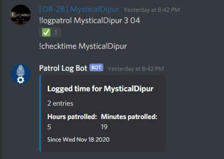
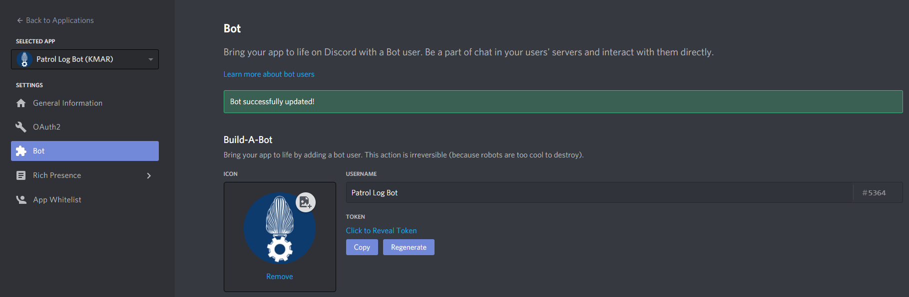
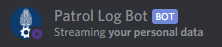

# Patrol Log Bot

By Me  
@willem#5819  
Version 1.4.1
  
## Introduction
### What does this bot do?
This Discord bot can be added to your Discord Server, wherein it can be used to log patrols. It has a very simple interface and has some nice features to make use of the bot straight forward, easy and quick to use.  
  

### Short disclaimer
This is my first Open Source project, and I do not intend to make it accessible to every soul on earth. I just want to put this out there for those that want an easy to use logging bot, without having to hire a scripter to make one for them. I've been asked a lot if I can make bots for people, but instead I will post this here. I shall update this repo with every update I make to the bot, however keeping up with the most recent version is completely up to you. Any security breaches due to me failing at making proper code is also not my responsibility, I'm verry sorry.  
All the notes and marks written in scripts and other files are made by me aimed towards me. Don't take it personally.
  
## How do I set it up?
I am going to assume you have basic knowledge of file systems and operating systems. It's not that hard to set this up, but it might get tricky. Once again, this isn't meant to be a two-click install.
1. Find a suitable device to install your bot on. I like to use a Raspberry Pi, which is powered all the time. There are of course alternatives, for example online VPS services such as [feroxhosting](https://feroxhosting.nl/vps). (not a sponsor or an ad, by the way)
1. Install [node.js](https://nodejs.org/en/) on the system.
1. Make a dedicated folder and download the repo.
1. [Create a bot for your server.](https://discordpy.readthedocs.io/en/latest/discord.html)
    - The bot does not need any special permissions to run. You can leave all perms unticked.
1. Copy the token from your bot and paste it in the *token.json* file, surrounded by quotation marks.

1. Start the bot by running *sh START.sh* or *node plb.js*. Before running the bot for the first time, you will need to change *preferences.json*.

## preferences.json
To make this bot all yours, here are some preferences you might want to change:
- **prefix**: Speaks for itself.
- **moderatorrole**: The name of the role with which you can perform certain administrative tasks, such as clearing all the logs.
- **botlogchannelid**: The ID of the channel in which you want the bog to call all actions performed. Retrieve this ID by turning on *developer mode* on Discord, right clicking a channel and copying the channel ID.
- **color**: The color of the embeds. The default is a navy blue color. [This is a hex code.](https://www.google.com/search?q=color+picker)
- **activities**: Setting this to true will have the bot put 'funny' messages in it's player menu. These activities can be added/changed/removed in *activities.json*. Not a fan of this feature? Just write 'false' and the activities won't show up.  

- **owners**: A table of user IDs. This has the same purpose as **moderatorrole**, except you don't need to have the role, thus access can never be restricted to these people, unless changed in the *preferences.json* file. You can retrieve a user ID by enabling *Developer Mode* and right clicking on a user, then copying the User ID. Make sure to copy this into the quotes, and to use commas when using multiple values!

### Activities
The bot automatically selects a random activity from *activities.json* 4 times a day. You can change these activities manually. Restarting the bot is not necessary. The actual activity can be anything you like. The type of activity must be one of the following (Discord limitation):
- PLAYING
- STREAMING
- LISTENING
- WATCHING
- CUSTOM_STATUS
- COMPETING

### Commands
When you have set up the bot, you can use !help (or whatever your prefix is) to view all the commands you can use for the bot.  
  
Two commands are not listed, but are available.
- **pid**: This returns the Process ID of the script. Useful if you need to track down the process!
- **shutdown**: This command is only available to **owners** (as mentioned in *preferences.json*). Speaks for itself right?
- **restart**: Shuts the bot down and restarts it.

### Do you have questions/problems? Feel free to shoot me a DM on Discord! @willem#5819
