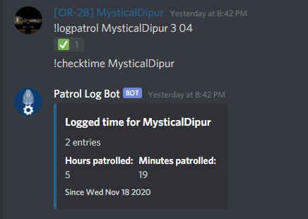

# Patrol Log Bot

By Me  
@willem#1111
  
## Introduction
### What does this bot do?
This Discord bot can be added to your Discord Server, wherein it can be used to log patrols. It has a very simple interface and has some nice features to make use of the bot straight forward, easy and quick to use.  
  
*Small example*  

### Short disclaimer
This is my first Open Source project, and I do not intend to make it accessible to every soul on earth. I just want to put this out there for those that want an easy to use logging bot, without having to hire a scripter to make one for them. I've been asked a lot if I can make bots for people, but instead I will post this here. I shall update this repo with every update I make to the bot, however keeping up with the most recent version is completely up to you. Any security breaches due to me failing at making proper code is also not my responsibility, I'm verry sorry.  
All the notes and marks written in scripts and other files are made by me aimed towards me. Don't take it personally.
  
## How do I set it up?
I am going to assume you have basic knowledge of file systems and operating systems. It's not that hard to set this up, but it might get tricky. Once again, this isn't meant to be a two-click install.
1. Find a suitable device to install your bot on. I like to use a Raspberry Pi, which is powered all the time. There are of course alternatives, for example online VPS services such as [feroxhosting](https://feroxhosting.nl/vps). (not a sponsor or an ad, by the way)
1. Install [node.js](https://nodejs.org/en/) on the system.
1. Make a dedicated folder and download the repo.
1. [Create a bot for your server.](https://discordpy.readthedocs.io/en/latest/discord.html)
    - The bot does not need any special permissions to run. You can leave all perms unticked.
1.   

not finished
